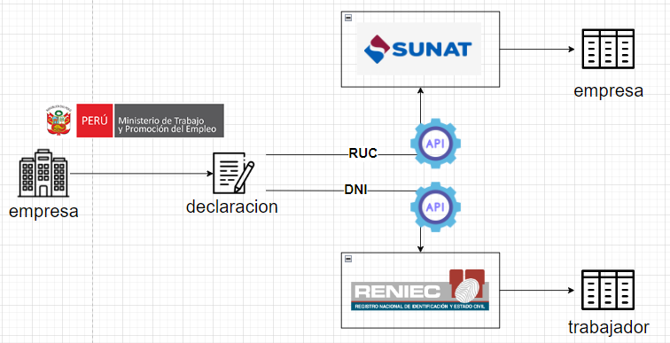
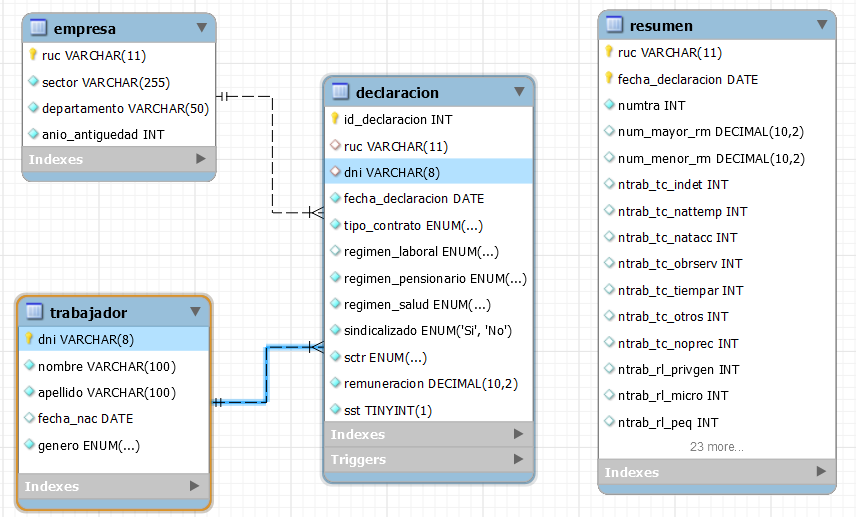
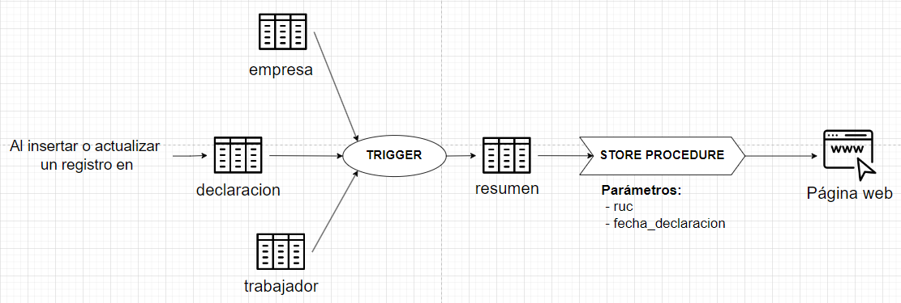

# Plataforma de Extracción de Datos y Cumplimiento Normativo

Este sistema de extracción de datos automatiza la validación y enriquecimiento de información de empresas y trabajadores en Perú, mediante la integración con APIs de entidades gubernamentales como SUNAT y RENIEC. El sistema facilita el cumplimiento normativo al asegurar la precisión y actualización en tiempo real de los datos obtenidos de fuentes oficiales.

## Funcionalidades Principales

### Fuentes de Información

1. **SUNAT**: A través del **RUC** de cada empresa, la API de SUNAT proporciona datos como el sector económico, ubicación (departamento) y fecha de constitución. Esta información se integra automáticamente en la base de datos para mantener los datos actualizados y fiables.

2. **RENIEC**: Utilizando el **DNI** de cada trabajador, la API de RENIEC provee datos personales como nombre, apellido, fecha de nacimiento y género. Esto permite almacenar información precisa y en tiempo real sobre los trabajadores.

### Ventajas del Enfoque de Integración de Datos

- **Precisión y Actualización**: Al extraer datos directamente de fuentes oficiales, la plataforma asegura que la información esté siempre actualizada, eliminando la necesidad de ingreso manual y reduciendo la probabilidad de errores.
- **Automatización de la Validación**: La conexión automática a las APIs permite enriquecer cada declaración de manera eficiente y sin intervención manual.
- **Cumplimiento Normativo en Tiempo Real**: La verificación del cumplimiento normativo se realiza de forma automática, asegurando que tanto empresas como trabajadores cumplen con las normativas sociolaborales y de seguridad y salud en el trabajo (SST).

### Arquitectura de Extracción de Datos

La arquitectura del sistema permite el flujo de datos desde la declaración inicial hasta el almacenamiento en la base de datos, pasando por el enriquecimiento de datos a través de las APIs.

1. **Recepción de Declaración**: El sistema recibe los datos iniciales de la empresa y trabajadores.
2. **Consultas a APIs**: Utilizando el **RUC** y el **DNI**, se consultan las APIs para obtener datos adicionales.
3. **Almacenamiento en Base de Datos**: La información se guarda en las tablas `empresa` y `trabajador`, permitiendo su reutilización y análisis posterior.

*Figura 1: Arquitectura de Extracción de Datos*

## Estructura de la Base de Datos

### Tabla `empresa`

| Campo              | Descripción                                    |
|--------------------|------------------------------------------------|
| `ruc`              | Identificación única de la empresa (RUC)       |
| `sector`           | Sector económico de la empresa                 |
| `departamento`     | Ubicación (departamento) de la empresa         |
| `anio_antiguedad`  | Número de años en operación                    |

### Tabla `trabajador`

| Campo              | Descripción                                    |
|--------------------|------------------------------------------------|
| `dni`              | Identificación única del trabajador (DNI)      |
| `nombre`           | Nombres del trabajador                         |
| `apellido`         | Apellidos del trabajador                       |
| `fecha_nac`        | Fecha de nacimiento                            |
| `genero`           | Género del trabajador                          |

### Otras Tablas: `declaracion` y `resumen`

1. **Tabla `declaracion`**: Registra información detallada sobre cada declaración de cumplimiento normativo.
2. **Tabla `resumen`**: Consolida los datos clave para facilitar el análisis y generación de reportes.

*Figura 2: Modelo Entidad-Relación*

## Automatización mediante Triggers y Stored Procedures

Para mantener los datos actualizados y facilitar el acceso desde la interfaz web, el sistema implementa triggers y stored procedures.

- **Trigger de Actualización**: Cada vez que se inserta o actualiza una declaración, el trigger actualiza automáticamente la tabla `resumen`.
- **Stored Procedure (SP) para Conexión con la Página Web**: Permite la conexión entre la base de datos y la página web, facilitando la consulta de datos en tiempo real por parte de los usuarios.

*Figura 3: Interacción entre las tablas con el Trigger y Store Procedure*

## Archivos SQL

- [creation.sql](creation.sql): Script para la creación de la base de datos y tablas.
- [insertion.sql](insertion.sql): Script para la inserción de datos iniciales en las tablas.
- [store_procedure.sql](store_procedure.sql): Script para los stored procedures utilizados en la automatización.
- [trigger.sql](trigger.sql): Script para la configuración de triggers de actualización.

## Ejecución

1. **Configurar la Base de Datos**: Ejecutar `creation.sql` y `insertion.sql` para crear y poblar las tablas.
2. **Configurar Automatización**: Ejecutar `store_procedure.sql` y `trigger.sql` para habilitar los stored procedures y triggers de actualización.
3. **Integrar con APIs**: Configurar la conexión con las APIs de SUNAT y RENIEC para habilitar la extracción de datos en tiempo real.