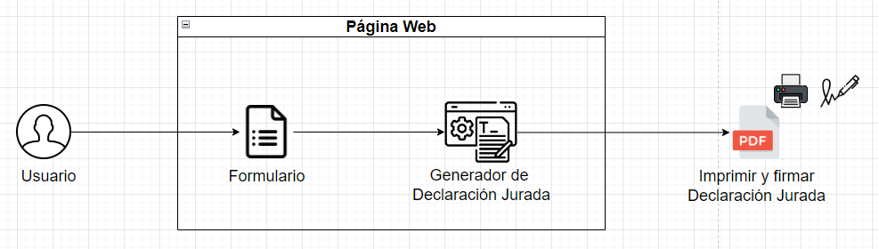

# Generador de PDF: Declaración Jurada

- [Descripción del Proyecto](#descripción-del-proyecto)
- [Arquitectura del Sistema](#arquitectura-del-sistema)
- [Llenado del Formulario](#llenado-del-formulario)
- [Generación de Documento PDF y DOCX](#generación-de-documento-pdf-y-docx)
- [Validación Física](#validación-física)
- [Requerimientos](#requerimientos)

---

## Descripción del Proyecto

Este sistema permite generar automáticamente una declaración jurada en formato PDF y DOCX, que debe ser impresa, firmada y sellada para que tenga validez legal. La funcionalidad está diseñada para asegurar la consistencia en el formato y agilizar el proceso de creación de documentos.

---
## Arquitectura del Sistema

> Figura 1: Arquitectura de Generación de PDF: Declaración Jurada
---

## Llenado del Formulario

El sistema requiere que el usuario complete un formulario en línea con la siguiente información, que es fundamental para la generación precisa de la declaración jurada:

| Campo                      | Descripción                                               |
|----------------------------|-----------------------------------------------------------|
| **Nombre del Representante** | Nombre completo de la persona que representa a la empresa. |
| **DNI del Representante**  | Número de Documento Nacional de Identidad del representante. |
| **Nombre de la Empresa**   | Nombre legal de la empresa a la cual representa.           |
| **RUC de la Empresa**      | Número de Registro Único de Contribuyente de la empresa.  |
| **Dirección de la Empresa**| Ubicación fiscal de la empresa.                           |
| **Sector**                 | Sector económico o industria en la que opera la empresa.  |
| **Cantidad de Trabajadores** | Número total de empleados en la empresa.                  |
| **Fecha de Generación**    | ``Se genera automáticamente``                |
| **Ubicación**              | Ciudad y país donde se realiza la declaración.            |

Es fundamental que todos los campos se completen de manera precisa y completa para evitar errores en el documento final y asegurar que cumpla con los requisitos legales de la declaración jurada.

---
## Generación de Documento PDF y DOCX

El sistema utiliza una plantilla predefinida para generar automáticamente la declaración jurada en formatos **DOCX** y **PDF**. A partir de los datos ingresados en el formulario, el sistema completa la plantilla y genera un documento final que sigue un formato estandarizado. Esto permite crear múltiples declaraciones de forma rápida y consistente, asegurando una presentación uniforme y profesional.

La plantilla utilizada para la generación de los documentos está disponible en el siguiente enlace: [plantilla.docx](https://github.com/haroldeustaquio/Labora-Tech-2024/blob/main/generate_pdf_decl-jur/plantilla.docx).

---
## Validación Física
Para que el documento tenga validez legal, es necesario:

- Imprimir el documento generado.
- Firmarlo y sellarlo físicamente.
- Este paso es obligatorio según las normativas vigentes, lo que garantiza que el documento cumpla con los requisitos legales.

---
## Requerimientos
  - `pandas`
  - `docx`
  - `datetime`
  - `docx2pdf`
