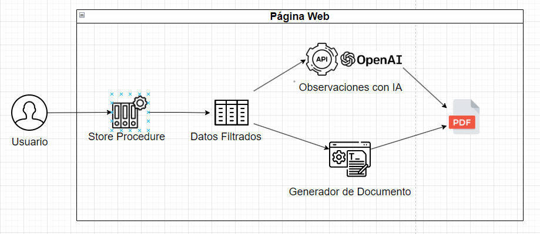

# Generador de PDF: Planilla Electrónica con Observaciones usando IA

- [Descripción del Proyecto](#descripción-del-proyecto)
- [Arquitectura del Sistema](#arquitectura-del-sistema)
- [Store Procedure](#store-procedure)
- [Generación de Documento PDF y DOCX](#generación-de-documento-pdf-y-docx)
- [Observaciones con IA usando OpenAI](#observaciones-con-ia-usando-openai)
- [Requerimientos](#requerimientos)

---

## Descripción del Proyecto

El sistema genera un documento PDF que resume la información clave de una empresa, como el número de trabajadores, el tipo de contratos, el régimen de salud, entre otros. A través de la integración con IA, el sistema puede generar observaciones automáticas que brindan un análisis detallado basado en los datos proporcionados.

## Arquitectura del Sistema

*Figura 1: Arquitectura de Generación de PDF: Planilla Electrónica con Observaciones usando IA*

---

## Store Procedure

Esta es la primera etapa en la que el usuario interactúa con el sistema. El **Store Procedure** es una consulta predefinida en la base de datos que:
- Filtra y devuelve datos específicos relevantes para la generación de la planilla.
- Incluye información precisa sobre la empresa y el periodo, limitando la cantidad de información a lo esencial para el informe.

---

## Generación de Documento PDF y DOCX

Con los datos filtrados, esta etapa se encarga de rellenar una plantilla de documento para generar un PDF. Características principales:
- **Estructura consistente**: La plantilla contiene secciones predefinidas, donde se insertan los datos específicos.
- **Eficiencia y precisión**: Automatiza la generación de documentos, minimizando errores humanos y permitiendo producir informes estandarizados.

---

## Observaciones con IA usando OpenAI

En esta etapa, los datos filtrados se envían a la API de **OpenAI** para generar observaciones automáticas:
- **Prompt estructurado**: Utiliza un prompt específico para que la IA genere comentarios o análisis detallados.
- **Análisis sin intervención manual**: La IA añade valor al documento con observaciones inteligentes.
- **Costo aproximado**: El costo por solicitud es aproximadamente 0.06 USD, utilizando el modelo GPT-4 de OpenAI. Este cálculo considera la longitud promedio del prompt y de la respuesta generada.

## Requerimientos

- ``pandas``
- ``docx``
- ``openai``
- ``docx2pdf``